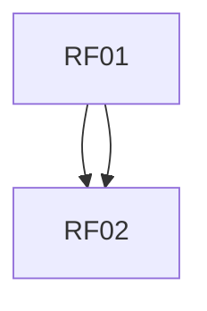

# Requisitos Funcionais
| Item | Descrição | Dependências | Habilitados | Atores |
| --- | --- | --- | --- | --- |
| RF01 | O sistema deve permitir que usuários gerem código front-end em Vue.js a partir da leitura de um arquivo .spark, garantindo documentação em trechos pertinentes para um melhor entendimento do código. |  | RF02 |  |
| RF02 | O sistema deve, automaticamente, por meio de ferramentas CI integradas ao GitHub e ao GitLab, garantir que o código tenha o seu funcionamento normal devidamente testado, de modo que, caso os testes sejam validados, as alterações e a consequente nova versão sejam publicadas automaticamente. | RF01, RF01 |  |  |


# Requisitos Não Funcionais
| Item | Descrição | Dependências | Habilitados | Atores |
| --- | --- | --- | --- | --- |
| RNF06 | O Sistema deverá possuir estruturas herdadas de uma classe pai para evitar duplicações existentes dessas mesmas estruturas no spark-lib e no andes-lib (preferencialmente, chamando-se module-doc-lib) |  |  |  |
| RNF05 | Os arquivos de CI gerados serão 2: um adequado ao CI mediante GitHub e outro adequado ao CI mediante GitLab |  |  |  |
| RNF03 | O gerador que gerará arquivos de CI deverá ser feito em python |  |  |  |
| RNF02 | O front-end deverá permanecer em Vue.js |  |  |  |
| RNF01 | A interface front-end gerada pelo sistema não deve possuir elementos depreciados, quebrados ou sem razão de ser. |  |  |  |


# Regras de Negócio
| Item | Descrição | Dependências | Habilitados | Atores |
| --- | --- | --- | --- | --- |


# Grafos de Dependências

## Requisitos Funcionais



## Requisitos Nao Funcionais

```mermaid
graph TD

```

## Regras de Negócio

```mermaid
graph TD

```